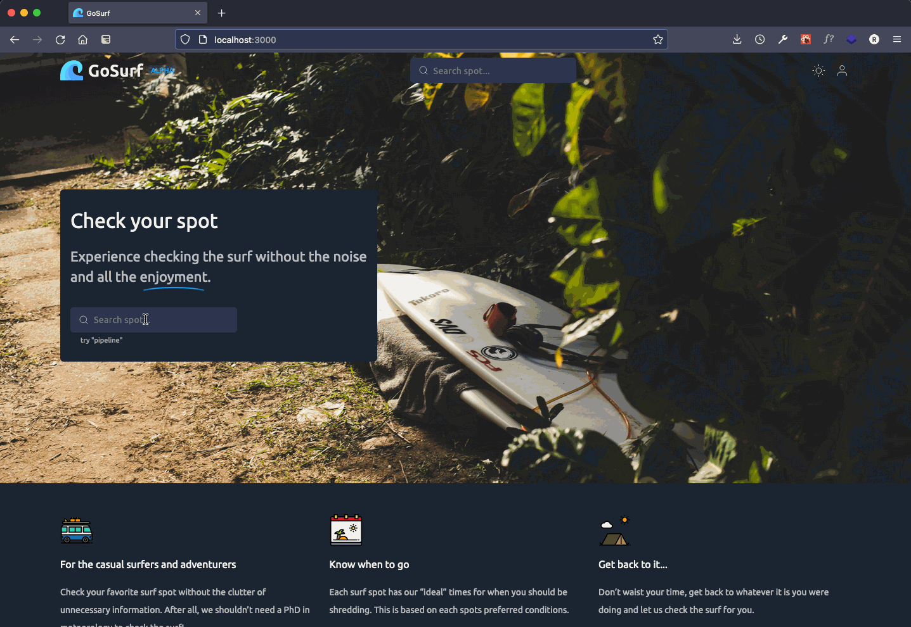

  

<h1 align="center">Simplify checking the surf forecast</h1>

GoSurf is a modern web application that aims to simplify checking the surf forecast for your local surf spot in a clean but simplistic UI/UX.

The concept for GoSurf is based on the fact that modern day surf tracking sites and applications are extremely noisy, and difficult to understand.

Check out the GoSurf [Backend Repo](https://github.com/ryan-neil/gosurf-backend)!

 

  

 

# 🚀 Features

- 🤙🏻 **Ease of use**: GoSurf is for the casual shredder who doesn't care about the extra "noise" of modern surf forecasting sites
- ✨ **Ideal conditions**: Ideal forecast conditions modeled to each surf spot
- 🌊 **Wave heights**: Hour by hour wave heights and periods as well as the days range
- 💧 **Tides**: Tide data on the extremes (high's and low's) for the day
- 💨 **Wind**: Hour by hour wind speed and direction for the day
- 🏄🏼‍♂️ **Swell**: Primary and secondary swell data
- 🌜 **Dark mode**: GoSurf offers a clean, modern dark theme for those early mornings or late night surf checks

 

# 🧑🏽‍💻 For Developers

Interested in the application? Checkout our [App Configuration](https://github.com/ryan-neil/gosurf-backend#%EF%B8%8F-app-configuration) section of the GoSurf backend repo and have a look under the hood. If we missed your favorite spot let us know! We're always looking to expand our forecasting reach.

GoSurf is and always will be [Open Source](https://opensource.com/resources/what-open-source) and for the surfing community.

 

# Contributing

Contributions are always welcome! Review the [Contributing](https://github.com/ryan-neil/gosurf-backend#%EF%B8%8F-contributing) section of the backend repo on how to contribute to the project!

 

---

### License

[MIT](https://github.com/ryan-neil/gosurf/blob/master/LICENSE) © [Ryan Neil](https://github.com/ryan-neil)
